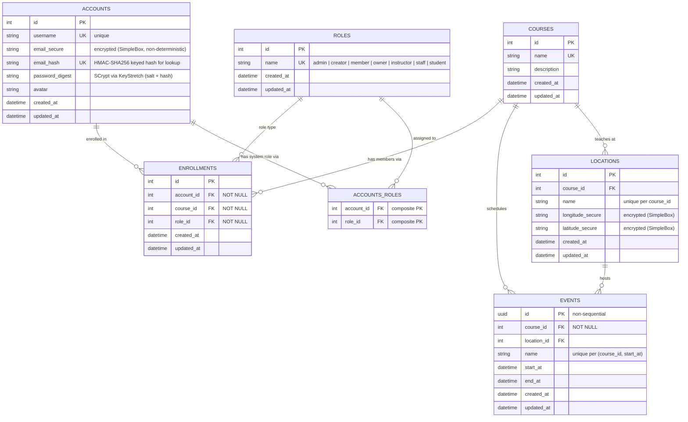

# Database Schema

Tyto's relational schema, as migrated on the current branch. GitHub renders
the Mermaid block below as a diagram; the notes afterwards capture the
design decisions a pure ERD can't express (encryption, keyed-hash lookup,
unique-constraint intent, role-name enumeration).

## Entity-Relationship Diagram

## Notes

### Encryption at rest

- **`accounts.email_secure`** — RbNaCl SimpleBox ciphertext. Non-deterministic
  (fresh nonce per encryption), so two accounts with the same email produce
  different ciphertexts. Reversible only with `DB_KEY`.
- **`accounts.email_hash`** — HMAC-SHA256 of the plaintext email under a
  **separate** `HASH_KEY`. Deterministic, so equality lookup works
  (`WHERE email_hash = ?`) and a `UNIQUE` constraint keeps duplicates out.
  One-way: attacker with only a DB dump cannot recover the plaintext.
- **`locations.longitude_secure`** / **`latitude_secure`** — same SimpleBox
  pattern. Coordinates are PII for the attendance domain; encrypted at rest.

### Password storage

- **`accounts.password_digest`** stores the JSON-encoded output of the
  `Password` value object: `{"salt": ..., "hash": ...}`, both Base64-encoded.
  The hash is produced by SCrypt (`opslimit = 2**20`, `memlimit = 2**24`,
  `digest_size = 64`) via the `KeyStretch` module — GPU/ASIC-resistant by
  construction.

### Role enumeration

The `roles` table is seeded with seven canonical names and is treated as
read-only reference data. The names split into two categories by where they
are referenced:

| Role         | Category      | Attached via     |
| ------------ | ------------- | ---------------- |
| `admin`      | System-level  | `accounts_roles` |
| `creator`    | System-level  | `accounts_roles` |
| `member`     | System-level  | `accounts_roles` |
| `owner`      | Course-level  | `enrollments`    |
| `instructor` | Course-level  | `enrollments`    |
| `staff`      | Course-level  | `enrollments`    |
| `student`    | Course-level  | `enrollments`    |

A single shared `roles` table lets FK constraints catch typos on both joins
and keeps role names in one place.

### Uniqueness and integrity

- **`enrollments`** has a `UNIQUE` constraint on `(account_id, course_id, role_id)`.
  An account can hold multiple roles in the same course (e.g., `instructor` +
  `owner`), but the exact `(account, course, role)` triple cannot repeat.
- **`accounts_roles`** uses a composite PK `(account_id, role_id)` — no
  duplicate system-role assignments possible.
- **`accounts.username`** and **`accounts.email_hash`** are both `UNIQUE`,
  either one can identify an account.
- **`courses.name`** is `UNIQUE` (globally, not per-owner).
- **`locations`** has `UNIQUE (course_id, name)`.
- **`events`** has `UNIQUE (course_id, name, start_at)`.

### Why no `owner_id` on courses

Course ownership lives in `enrollments` as `role_id = <owner>` rather than as
a dedicated FK on `courses`. This keeps a single source of truth for "who
has what authority on this course" and avoids the denormalization risk of
two structures disagreeing. `Course#owner` is a convenience method that
queries enrollments; transactional atomicity (course + owner enrollment
created together, or neither) is handled by the `CreateCourseForOwner`
service.

### Cascade behavior

- **`Account#destroy`** → `association_dependencies, courses: :nullify` —
  removes the account's enrollment rows in one bulk DELETE via the
  `many_to_many`. Courses survive; ownerless ones remain until reassigned.
- **`Course#destroy`** → `events: :destroy`, `locations: :destroy`,
  `enrollments: :delete` — events and locations go through per-row
  `.destroy` (may grow hooks later); enrollments are bulk-deleted since the
  `Enrollment` model has no hooks.

### Non-sequential event IDs

`events.id` is a UUID (not `AUTOINCREMENT`). An attacker who finds one event
ID cannot increment/decrement to probe for others. The `uuid` Sequel plugin
assigns IDs at the model layer so the application never sees a numeric ID
for an event.
